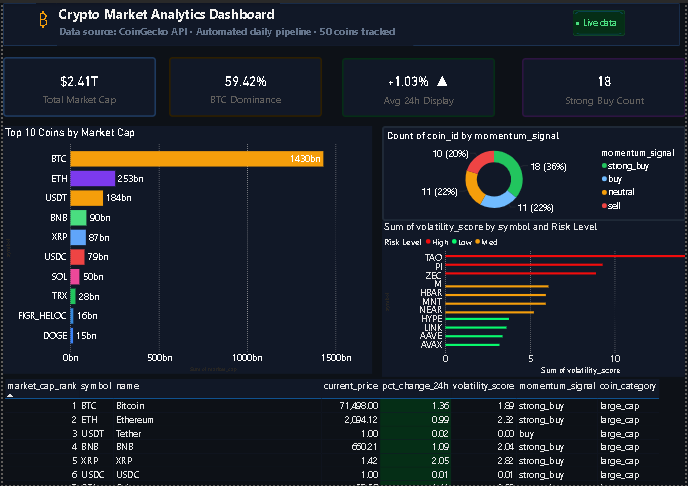

Crypto Market Analytics Pipeline

Automated end-to-end ETL pipeline extracting 50+ live crypto assets daily via CoinGecko API — with custom analyst KPIs, SQL analysis, daily scheduling, and an interactive Power BI dashboard.

Project Overview
This project demonstrates a complete data analyst workflow — from raw API data to a business-ready dashboard. The pipeline runs automatically every day at 8:00 AM, extracts fresh market data, engineers analyst metrics, stores them in a database, and refreshes the Power BI dashboard.
No manual work required after setup.

Architecture
CoinGecko API
     ↓
Extract (Python + requests)
     ↓
Transform (Pandas — clean + engineer KPIs)
     ↓
Load (SQLite — incremental loading)
     ↓
Automate (schedule — daily at 08:00)
     ↓
Visualize (Power BI Dashboard)

Features

Automated daily extraction via CoinGecko public REST API — no API key required
7 custom analyst KPIs engineered from raw market data
Incremental loading — only new records inserted each run, no duplicates
Error handling & logging — pipeline stops cleanly on failure, logs every run
Data validation — checks row count and null prices after every load
SQL analysis — window functions, CTEs, aggregations, rankings
Interactive Power BI dashboard — live cards, bar charts, donut chart, data table with conditional formatting

Custom KPIs Engineered
KPIDescriptionmarket_dominance_pctCoin's share of total market capvolatility_score24h price range as % of current pricevolume_to_mcap_ratioTrading activity relative to market sizemomentum_signalBuy/sell signal based on 1h, 24h, 7d trendath_distance_pctHow far coin is from all-time highcoin_categoryLarge / mid / small cap classificationprice_positionNear 24h high / low / mid range

SQL Analysis Queries
Five analyst-grade queries written against the database:

Top 10 coins by market cap
Best performer per category using RANK() OVER (PARTITION BY)
Momentum signal summary with GROUP BY and multiple aggregations
Strong buy coins near 24h high using CTE (WITH clause)
Most volatile small cap coins

Tech Stack
LayerToolLanguagePython 3.12Data extractionrequests, CoinGecko APIData transformationPandas, NumPyDatabaseSQLite, SQLAlchemySchedulingscheduleVisualizationPower BI, DAXVersion controlGit, GitHub

How to Run
1. Clone the repo
bashgit clone https://github.com/abhi0348/crypto-etl-pipeline.git
cd crypto-etl-pipeline
2. Install dependencies
bashpip install requests pandas sqlalchemy python-dotenv schedule
3. Run the pipeline once
bashpython run_pipeline.py
4. Schedule daily runs
The pipeline auto-schedules itself. Keep the terminal open or set it up as a Windows Task Scheduler job. It runs every day at 08:00 AM automatically.
5. Open the dashboard
Open dashboard/Crypto_Analytics_Dashboard.pbix in Power BI Desktop and click Refresh.
## Dashboard Preview

Author:  
Abhishek Yadav.  
Data Analyst · 2+ years experience · Power BI · SQL · Python  

LinkedIn: [linkedin.com/in/abhishek-yadav](https://www.linkedin.com/in/abhishek-yadav-05b00616b/)  
GitHub: [github.com/abhi0348](https://github.com/abhi0348)  
Email: ay0187900@gmail.com  
